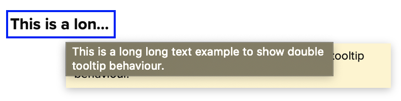

<link rel="stylesheet" href="../resources/styles/elf-template.css">

## Auto Tooltip

The Auto Tooltip Extension displays clipped information when the user hovers the pointer over the content or title.

```live
<style>
	atlas-blotter {
		height: 200px;
	}
</style>

<atlas-blotter id="grid"></atlas-blotter>

<script>
	var fields = ["companyName", "market", "CF_LAST", "CF_NETCHNG", "industry"];
	var records = tr.DataGenerator.generateRecords(fields, { seed: 2, numRows: 5 });
	var configObj = {
		columns: [
			{name: "Company", field: fields[0], width: 100},
			{name: "Market", field: fields[1]},
			{name: "Last", field: fields[2]},
			{name: "Net. Chng", field: fields[3]},
			{name: "Industry", field: fields[4], width: 120}
		],
		staticDataRows: records,
		autoTooltip: {
			title: true
		},
		extensions: [
			new tr.AutoTooltipExtension()
		]
	};

	var grid = document.getElementById("grid");
	grid.config = configObj;
</script>
```

> Note: the auto tooltip will not be added to non-clipped text.

### Installation and importing to your project

Installation details and examples, along with information on how to import the extension to your project, are available on the [Overview page](README.md).

### Specific column

To enable `Auto Tooltip` in a specific column only:
	* Set `content: false` in the extension's option
	* Set `autoTooltip: true` in the column's option

```live
<style>
	atlas-blotter {
		height: 200px;
	}
</style>

<atlas-blotter id="grid"></atlas-blotter>

<script>
	var fields = ["companyName", "market", "CF_LAST", "CF_NETCHNG", "industry"];
	var records = tr.DataGenerator.generateRecords(fields, { seed: 2, numRows: 5 });
	var configObj = {
		columns: [
			{name: "Company", field: fields[0], width: 100},
			{name: "Market", field: fields[1]},
			{name: "Last", field: fields[2]},
			{name: "Net. Chng", field: fields[3]},
			{name: "Auto Tooltip", field: fields[4], width: 120, autoTooltip: true},
			{name: "No Tooltip", field: fields[4], width: 120}
		],
		staticDataRows: records,
		autoTooltip: {
			title: true,
			content: false
		},
		extensions: [
			new tr.AutoTooltipExtension()
		]
	};

	var grid = document.getElementById("grid");
	grid.config = configObj;
</script>
```

```js
var grid = document.getElementById('grid');
grid.config = {
	// any other grid's options
	columns: [
		{ name: 'Column 1', field: 'field1', autoTooltip: true }
	],
	autoTooltip: {
		title: true,
		content: false
	},
	extensions: [
		new tr.AutoTooltipExtension()
	]
};
```

### Custom tooltip

Adding custom tooltip doesn't require auto-tooltip extension. Therefore, The mechanism to make tooltip appear is depend on your logic. You can use cell api to set custom tooltip. For detail, please see [Cell API](../apis/composite_grid/tr.grid.Cell.md).

```live
<style>
 atlas-blotter {
  height: 200px;
 }
</style>

<atlas-blotter id="grid"></atlas-blotter>

<script>
 var fields = ["industry"];
 var records = tr.DataGenerator.generateRecords(fields, { seed: 2, numRows: 5 });
 var configObj = {
  columns: [
   {name: "Auto Tooltip", field: fields[0], width: 120, autoTooltip: true},
   {name: "Custom Tooltip", field: fields[0], width: 120, binding: customRenderer},
  ],
  staticDataRows: records,
  autoTooltip: {
   content: false
  },
  extensions: [
   new tr.AutoTooltipExtension()
  ]
 };

 var grid = document.getElementById("grid");
 grid.config = configObj;

 function customRenderer(e) {
  e.cell.setContent(e.data);
  e.cell.setTooltip('Custom tooltip: ' + e.data);
 }
</script>
```

### Limitation

#### Safari

There was a double tooltip issue in safari when ELF tooltip has been used. One is from ELF tooltip and another one is a native tooltip from Safari that automatically apply to clipped text by itself. Therefore, Auto tooltip will be disabled in Safari.

The image below is an example double tooltip in Safari.



For live example

```live
<style>
 .container {
  padding: 5px;
 }
 .clipped {
  width: 100px;
  display: inline-block;
  white-space: nowrap;
  overflow: hidden;
  text-overflow: ellipsis;
  border: blue solid 2px;
  font-size: 16px;
  font-weight: bold;
  padding: 2px;
 }
</style>

<div class="container">
  <h5>Double tooltip will occur at clipped text</h5>
  <div class="clipped" title="This is a long long text example to show double tooltip behaviour.">This is a long long text example to show double tooltip behaviour.</div>
  <h5>Short text is fine</h5>
  <div class="clipped" title="Short text is fine.">Short text</div>
</div>

<script></script>
```

> Note: Please be aware that double tooltip can still be appeared in other part of your page.

#### Text is clipped but tooltip doesn't shown

Sometime you might see clipped text but tooltip doesn't shown. That's because we can't detect clipped text when `width of text` and `width of container` are nearly equal.

Text will be clipped when text is long enough to exceeds container's width. In technical, text is clipped when scrollWidth exceeded clientWidth. So we can detect clipped text by using `scrollWidth > clientWidth`.

However browser will calculate with decimal precision, eg. scrollWidth: 118.42, clientWidth: 118.

But javascript will only return round value of scrollWidth and clientWidth, eg. scrollWidth: 118.42 ~ 118, clientWidth: 118.

So that we cannot detect ellipsis in some of edge case.

Please see the example below for better understanding.

```live
<style>
.example {
	display: inline-block;
	border: 0;
	color: white;
	background-color: black;
	font-size: 18px;
	white-space: nowrap;
	overflow: hidden;
	text-overflow: ellipsis;
	margin-top: 10px;
}

.detail {
	margin-top: 5px;
	font-size: 16px;
	line-height: 20px;
}

</style>

<h3>Round up case</h3>
<div class='detail'>
	Actual scrollWidth: 112.84px, javascript will round up to 113 <br>
	Actual clientWidth: 112px <br>
	113 > 112 = true <br>
	tooltip will be setted
</div>
<div class='example' style="width: 112px;">sample text ~~~</div>
<h3>Round down case</h3>
<div class='detail'>
	Actual scrollWidth: 118.42px, javascript will round down to 118 <br>
	Actual clientWidth: 118px <br>
	118 > 118 = false <br>
	no tooltip apply
</div>
<div class='example' style="width: 118px;">sample text ~ ~</div>

<script>
setTimeout(function() {
	var examples = document.getElementsByClassName('example');
	for (var i = 0; i < examples.length; i++) {
		var elem = examples[i];
		if (elem.scrollWidth > elem.clientWidth) {
			elem.setAttribute('title', 'tooltip setted.');
		}
	}
}, 1000)
</script>
```


<div></div>

<h2 style="margin-bottom:5px" id="api-refs">API Reference</h2>
<div id="elf-api-container"><div id="main-template" class="elf-template">    <section><article>                                                                        <h3 class="subsection-title">Type Definitions</h3>                        <div class="item">            <div class="item-type">typedef</div>    <h4 class="name" id="~ColumnOptions">ColumnOptions</h4><div class="description">    Available column options specified in grid's column configuration</div>    <h5>Type:</h5>    <span class="param-type">Object</span>    <h5>Properties:</h5>    <div class="props"><table>    <thead>    <tr>                <th>Name</th>                <th>Type</th>                <th>Attributes</th>                        <th>Default</th>                <th class="last">Description</th>    </tr>    </thead>    <tbody>            <tr>                            <td class="name"><code>autoTooltip</code></td>                        <td class="type">                            <span class="param-type">boolean</span>                        </td>                            <td class="attributes">                                    &lt;optional&gt;<br>                                                </td>                                        <td class="default">                                    false                                </td>                        <td class="description last">If enabled, the column is qualified for showing tooltip</td>        </tr>        </tbody></table></div><div class="details">                                                            </div></div>                            <div class="item">            <div class="item-type">typedef</div>    <h4 class="name" id="~Options">Options</h4><div class="description">    Available options describing `autoTooltip` object specified in grid's option</div>    <h5>Type:</h5>    <span class="param-type">Object</span>    <h5>Properties:</h5>    <div class="props"><table>    <thead>    <tr>                <th>Name</th>                <th>Type</th>                <th>Attributes</th>                        <th>Default</th>                <th class="last">Description</th>    </tr>    </thead>    <tbody>            <tr>                            <td class="name"><code>header</code></td>                        <td class="type">                            <span class="param-type">boolean</span>                        </td>                            <td class="attributes">                                    &lt;optional&gt;<br>                                                </td>                                        <td class="default">                                    false                                </td>                        <td class="description last">If true, text in the header sections (top section) will be qualified for showing tooltip.</td>        </tr>            <tr>                            <td class="name"><code>title</code></td>                        <td class="type">                            <span class="param-type">boolean</span>                        </td>                            <td class="attributes">                                    &lt;optional&gt;<br>                                                </td>                                        <td class="default">                                    false                                </td>                        <td class="description last">Alias to `header`</td>        </tr>            <tr>                            <td class="name"><code>footer</code></td>                        <td class="type">                            <span class="param-type">boolean</span>                        </td>                            <td class="attributes">                                    &lt;optional&gt;<br>                                                </td>                                        <td class="default">                                    false                                </td>                        <td class="description last">If true, text in the footer sections will be qualified for showing tooltip.</td>        </tr>            <tr>                            <td class="name"><code>content</code></td>                        <td class="type">                            <span class="param-type">boolean</span>                        </td>                            <td class="attributes">                                    &lt;optional&gt;<br>                                                </td>                                        <td class="default">                                    true                                </td>                        <td class="description last">If true, text in the content section will be qualified for showing tooltip. Use autoTooltip flag in column configuration to turn on auto-tooltip for individual column</td>        </tr>            <tr>                            <td class="name"><code>quickMode</code></td>                        <td class="type">                            <span class="param-type">boolean</span>                        </td>                            <td class="attributes">                                    &lt;optional&gt;<br>                                                </td>                                        <td class="default">                                    false                                </td>                        <td class="description last">Deprecated</td>        </tr>        </tbody></table></div><div class="details">                                                            </div></div>                            <h3 class="subsection-title">Methods</h3>                    <div class="item">                                <div class="item-type">function</div>                        <h4 class="name" id="applyTooltip"><span class="type-signature"></span>applyTooltip<span class="signature">(colIndex, fromR<span class="signature-attributes">opt</span>, toR<span class="signature-attributes">opt</span>)</span><span class="type-signature"></span></h4>                            <div class="description">        Force update and calculation on a single column. It is not recommended to be used multiple time successively    </div>                            <h5>Parameters:</h5>        <div class="params">        <div class="param">                            <div class="name">colIndex</div>                        <div class="type">                            <span class="param-type">number</span>                        </div>                            <div class="attributes">                                                                </div>                                                    <div class="description">                    Column index                </div>                    </div>                <div class="param">                            <div class="name">fromR</div>                        <div class="type">                            <span class="param-type">number</span>                        </div>                            <div class="attributes">                                    &lt;optional&gt;                                                                </div>                                                    <div class="description">                    Start row index                </div>                    </div>                <div class="param">                            <div class="name">toR</div>                        <div class="type">                            <span class="param-type">number</span>                        </div>                            <div class="attributes">                                    &lt;optional&gt;                                                                </div>                                                    <div class="description">                    End row index                </div>                    </div>            </div>        <div class="details">                                                            </div>                                    </div>                    <div class="item">                                <div class="item-type">function</div>                        <h4 class="name" id="applyTooltipToAllColumns"><span class="type-signature"></span>applyTooltipToAllColumns<span class="signature">()</span><span class="type-signature"></span></h4>                            <div class="description">        Force update and calculation on all columns    </div>                        <div class="details">                                                            </div>                                    </div>                    <div class="item">                                <div class="item-type">function</div>                        <h4 class="name" id="applyTooltipToColumns"><span class="type-signature"></span>applyTooltipToColumns<span class="signature">(colIndices<span class="signature-attributes">opt</span>)</span><span class="type-signature"></span></h4>                            <div class="description">        Force update and calculation on specific columns    </div>                            <h5>Parameters:</h5>        <div class="params">        <div class="param">                            <div class="name">colIndices</div>                        <div class="type">                            <span class="param-type">Array.&lt;number&gt;</span>                        </div>                            <div class="attributes">                                    &lt;optional&gt;                                                                </div>                                                    <div class="description">                    Column indices                </div>                    </div>            </div>        <div class="details">                                                            </div>                                    </div>                    <div class="item">                                <div class="item-type">function</div>                        <h4 class="name" id="config"><span class="type-signature"></span>config<span class="signature">(options<span class="signature-attributes">opt</span>)</span><span class="type-signature"></span></h4>                                                <h5>Parameters:</h5>        <div class="params">        <div class="param">                            <div class="name">options</div>                        <div class="type">                            <span class="param-type">Object</span>                        </div>                            <div class="attributes">                                    &lt;optional&gt;                                                                </div>                                                    <div class="description">                    Grid configuration object                </div>                    </div>            </div>        <div class="details">                                                            </div>                                    </div>                    <div class="item">                                <div class="item-type">function</div>                        <h4 class="name" id="getConfigObject"><span class="type-signature"></span>getConfigObject<span class="signature">(gridOptions<span class="signature-attributes">opt</span>)</span><span class="type-signature"> → {Object}</span></h4>                                                <h5>Parameters:</h5>        <div class="params">        <div class="param">                            <div class="name">gridOptions</div>                        <div class="type">                            <span class="param-type">Object</span>                        </div>                            <div class="attributes">                                    &lt;optional&gt;                                                                </div>                                            </div>            </div>        <div class="details">                                                            </div>                                <h5>Returns:</h5>                    <div class="sub-content">        <span class="param-type">Object</span>    </div>                </div>                    <div class="item">                                <div class="item-type">function</div>                        <h4 class="name" id="getName"><span class="type-signature"></span>getName<span class="signature">()</span><span class="type-signature"> → {string}</span></h4>                                            <div class="details">                                                            </div>                                <h5>Returns:</h5>                    <div class="sub-content">        <span class="param-type">string</span>    </div>                </div>                    <div class="item">                                <div class="item-type">function</div>                        <h4 class="name" id="hasMultiTableSupport"><span class="type-signature"></span>hasMultiTableSupport<span class="signature">()</span><span class="type-signature"> → {boolean}</span></h4>                            <div class="description">        Plugin that has multi-table support means that it can have multiple hosts/tables and share its states across those hosts/tables.    </div>                        <div class="details">                <dt class="inherited-from">Inherited From:</dt>    <dd class="inherited-from">        <a href="">GridPlugin#hasMultiTableSupport</a>    </dd>                                                    </div>                                <h5>Returns:</h5>                    <div class="sub-content">        <span class="param-type">boolean</span>    </div>                </div>                    <div class="item">                                <div class="item-type">function</div>                        <h4 class="name" id="initialize"><span class="type-signature"></span>initialize<span class="signature">(host, options<span class="signature-attributes">opt</span>)</span><span class="type-signature"></span></h4>                                                <h5>Parameters:</h5>        <div class="params">        <div class="param">                            <div class="name">host</div>                        <div class="type">                            <span class="param-type">Object</span>                        </div>                            <div class="attributes">                                                                </div>                                                    <div class="description">                    core grid                </div>                    </div>                <div class="param">                            <div class="name">options</div>                        <div class="type">                            <span class="param-type">Object</span>                        </div>                            <div class="attributes">                                    &lt;optional&gt;                                                                </div>                                            </div>            </div>        <div class="details">                                                            </div>                                    </div>                    <div class="item">                                <div class="item-type">function</div>                        <h4 class="name" id="requestTooltipUpdate"><span class="type-signature"></span>requestTooltipUpdate<span class="signature">()</span><span class="type-signature"></span></h4>                            <div class="description">        This is similar applyTooltipToColumns() method, but it consolidate multiple requests into one for better performance    </div>                        <div class="details">                                                            </div>                                    </div>                    <div class="item">                                <div class="item-type">function</div>                        <h4 class="name" id="unload"><span class="type-signature"></span>unload<span class="signature">(host)</span><span class="type-signature"></span></h4>                                                <h5>Parameters:</h5>        <div class="params">        <div class="param">                            <div class="name">host</div>                        <div class="type">                            <span class="param-type">Object</span>                        </div>                                                    <div class="description">                    core grid                </div>                    </div>            </div>        <div class="details">                                                            </div>                                    </div>                </article></section></div></div>